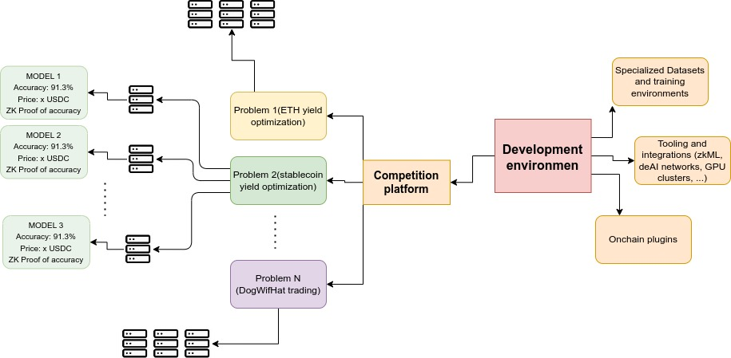
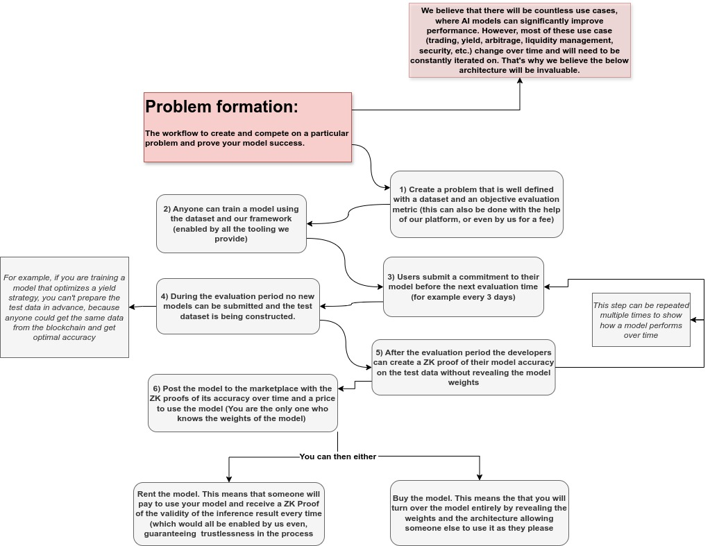

# Tensor Royale the worlds most powerful blockchain AI development platform.

## Overview

We are building an **AI development and collaboration platform** to revolutionize the intersection of AI and crypto. This platform aims to empower developers, companies, and DAOs to introduce problems, specify requirements, and offer incentives for solutions. Leveraging advanced cryptographic techniques, we ensure the privacy and integrity of AI models while fostering a collaborative and innovative ecosystem.

## Problem Statement

The convergence of AI and crypto holds immense potential but is currently immature and fragmented. Despite the rapid growth of AI developers, AI applications in crypto face significant barriers due to a lack of tools, data, and educational resources. Training AI models for blockchain is more complex than traditional AI tasks, requiring comprehensive support from ideation to deployment.

Furthermore, current platforms lack incentives for collaboration, limiting opportunities for AI developers to showcase their skills. Key challenges include the high cost of data science expertise, the need for trust and transparency in model training and deployment, and significant security risks in on-chain model deployment. 

For a deeper dive into our perspective, read our detailed thoughts on the subject here: [AI and Crypto](https://medium.com/@Snojj25/what-is-at-the-intersection-of-ai-and-crypto-9e6c6f0bdc84).

## Our Solution

Our platform addresses these challenges by offering a comprehensive suite of tools and infrastructure tailored for AI and crypto integration. Key features include:

- **Problem Introduction**: Users, companies, or DAOs can introduce problems and specify exact requirements.
- **Incentive Mechanisms**: Incentives for solutions foster a competitive and collaborative environment.
- **Privacy and Integrity**: Using ZK cryptography, we ensure model weights remain private while guaranteeing integrity and accuracy.
- **Comprehensive Support**: Aggregating top tools and infrastructure simplifies usage and integration.
- **Real-life Scenario Training**: Specialized environments and datasets enable realistic training and testing.
- **Seamless Deployment**: On-chain plugins facilitate easy model deployment.

## Competition and model marketplace

## Our Journey

We started this project during the ETH Global hackathon, where it won several prizes and garnered interest from potential backers. Believing in the transformative potential of combining blockchain and AI, we set out to address the critical need for integrated tools, resources, and incentives in this space.

## Our Team

Our founding team has over four years of joint experience, with diverse expertise in building and deploying blockchain products, developing AI projects, and conducting blockchain data analytics. We have strong connections with AI research institutions and a leading software development firm specializing in crypto and AI. This unique combination of experience, expertise, and strategic partnerships positions us to solve these challenges more effectively than any other team.

## Get Involved

We invite AI developers, blockchain enthusiasts, and organizations to join us in revolutionizing the AI and crypto space. Contribute to our projects, participate in hackathons, and help drive innovation at the intersection of these transformative technologies.

## Contact Us

For more information or to get involved, please reach out to us at [tensor.royale@proton.me] or visit our [website](https://example.com).
